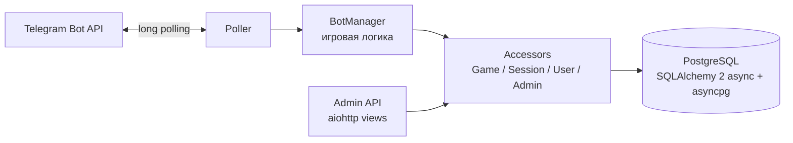

# «100 к 1» — Telegram-бот на aiohttp

[](https://github.com/dima040805/async-backend-framework/actions/workflows/main.yaml)


Многопользовательская игра «100 к 1» в Telegram-чатах. Игроки собираются в сессию,
угадывают самые популярные ответы на вопросы, бот ведёт счёт и таблицу лидеров.
Для администратора есть отдельное HTTP API: вопросы и варианты ответов, игровые сессии, игроки.

Проект сделан в школе бэкенд-разработки KTS на основе
[шаблона школы](https://github.com/ktsstudio/backend-school-template-project).

## Возможности

- Создание игры в чате, присоединение игроков через inline-кнопки и старт раунда.
- Приём ответов, подсчёт очков, переход к следующему вопросу, остановка игры.
- Таблица лидеров и статус текущей игры.
- Admin API на aiohttp: вход по cookie-сессии, CRUD вопросов, просмотр сессий и игроков, Swagger на `/docs`.
- Получение апдейтов Telegram через long polling в фоновой задаче.

## Архитектура



Модели: `Player`, `GameSession`, `SessionPlayer`, `Question`, `AnswerVariant`, `PlayerAnswer`, `WebAdmin`, `SessionAdmin` (`app/models/database.py`).

## Запуск

```bash
cp .env.example .env        # укажите TELEGRAM_TOKEN и SESSION_KEY
docker compose up --build
```

Локально:

```bash
python -m venv .venv && source .venv/bin/activate
pip install -r requirements.txt
export TELEGRAM_TOKEN=...
python main.py
```

Swagger admin API: http://localhost:8000/docs

## Конфигурация

Базовые значения лежат в `etc/config.yaml`. Секреты в репозиторий не кладутся —
они задаются переменными окружения, которые перекрывают файл:

| Переменная | Поле конфига |
|---|---|
| `TELEGRAM_TOKEN` | `telegram.token` |
| `SESSION_KEY` | `session.key` (32 байта, urlsafe base64) |
| `ADMIN_EMAIL`, `ADMIN_PASSWORD` | `admin.email`, `admin.password` |
| `DATABASE_HOST`, `DATABASE_USER`, `DATABASE_PASSWORD`, `DATABASE_NAME` | `database.*` |

## Admin API

| Метод | Путь | Назначение |
|---|---|---|
| POST | `/admin.login` | вход администратора |
| GET | `/admin.current` | текущий администратор |
| GET | `/admin.sessions` | игровые сессии |
| GET | `/admin.players` | игроки |
| GET / POST | `/admin.questions` | список и создание вопросов |
| PATCH | `/admin.questions/{question_id}` | изменение вопроса |

## Качество кода

```bash
ruff format --check && ruff check --no-fix
```

Проверка запускается в GitHub Actions на каждый push.
